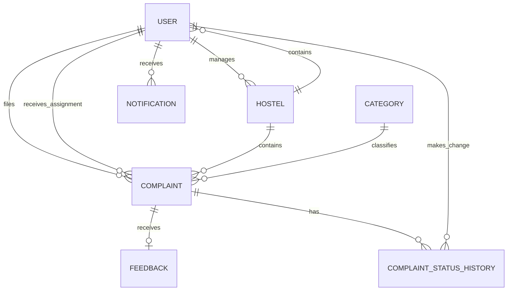

# HostelFixIT Domain Model

This document describes the persistent domain model for HostelFixIT, a hostel maintenance and complaint-management system. It covers the business entities, database tables, relationships, lifecycle rules, and the way the Java/JPA model maps to PostgreSQL.

## 1. Domain Overview

HostelFixIT is organized around a simple workflow:

1. A user belongs to a role and, usually, a hostel.
2. A student creates a complaint for a category of maintenance problem.
3. The complaint is associated with the student's hostel and may be assigned to a worker.
4. Wardens, admins, or workers update the complaint status.
5. Every status change can be recorded in an audit history.
6. Once resolved, the student can leave feedback.
7. The system sends notifications to users involved in the workflow.

The main aggregate is the `Complaint`. It connects the user, hostel, category, assignment, status lifecycle, audit history, feedback, and notifications.

## 2. Entity Relationship Diagram



### Relationship cardinality

| Relationship | Cardinality | Meaning |
|---|---:|---|
| `Hostel -> User` | 1 to many | A hostel may contain many students, workers, or wardens. |
| `User -> Hostel` | many to 1 | A user may belong to one hostel. Super admins normally have no hostel. |
| `User -> Hostel` as admin | 1 to many | An admin may manage multiple hostels. |
| `User -> Complaint` as student | 1 to many | A student may file multiple complaints. |
| `User -> Complaint` as assigned worker | 1 to many | A worker may be assigned multiple complaints. |
| `Hostel -> Complaint` | 1 to many | A hostel contains many complaints. |
| `Category -> Complaint` | 1 to many | A category can classify many complaints. |
| `Complaint -> Feedback` | 1 to 0 or 1 | A complaint may receive at most one feedback record. |
| `Complaint -> ComplaintStatusHistory` | 1 to many | A complaint may have many status changes. |
| `User -> ComplaintStatusHistory` | 1 to many | A user may perform many status changes. |
| `User -> Notification` | 1 to many | A user may receive many notifications. |

The JPA entities primarily define owning-side references. They do not expose bidirectional collection fields such as `Hostel.users` or `Complaint.history`; the application loads related records through repositories and service queries.

## 3. Entities and Tables

### 3.1 User

**Table:** `users`

`User` represents every authenticated person in the system.

| Field | Type | Rules |
|---|---|---|
| `id` | UUID | Primary key, generated automatically. |
| `name` | VARCHAR(255) | Required. |
| `phone` | BIGINT | Optional. |
| `email` | VARCHAR(150) | Optional in the database model, but unique when present. |
| `password` | VARCHAR(255) | Required; stored as a password hash and ignored in JSON responses. |
| `role` | enum/string | Required. One of `STUDENT`, `WORKER`, `WARDEN`, `ADMIN`, or `SUPER_ADMIN`. |
| `hostel_id` | UUID | Optional foreign key to `hostels.id`. |
| `is_active` | BOOLEAN | Required; defaults to `true`. Used for soft disabling. |
| `created_at` | timestamp with time zone | Required; set when created. |
| `updated_at` | timestamp with time zone | Updated when the entity changes. |

#### Roles

- **STUDENT**: creates complaints and provides feedback.
- **WORKER**: receives and resolves assigned complaints.
- **WARDEN**: manages complaints within a hostel.
- **ADMIN**: manages users, categories, and hostels within its administrative scope.
- **SUPER_ADMIN**: manages the complete platform and can manage admins and unassigned hostels.

A user's hostel relationship is implemented as `ManyToOne`. The database does not enforce role-to-hostel rules; those rules are enforced in the service and authorization layers.

### 3.2 Hostel

**Table:** `hostels`

`Hostel` is the primary tenant or organizational boundary for operational data.

| Field | Type | Rules |
|---|---|---|
| `id` | UUID | Primary key, generated automatically. |
| `name` | VARCHAR(255) | Required. |
| `address` | VARCHAR(255) | Optional. |
| `admin_id` | UUID | Optional foreign key to `users.id`. Represents the owning admin. |
| `created_at` | timestamp with time zone | Required; set when created. |

A hostel can have many users and complaints. `admin_id` may be null, which represents an unassigned hostel visible to a super admin until ownership is assigned.

### 3.3 Category

**Table:** `categories`

`Category` classifies the type of maintenance issue.

| Field | Type | Rules |
|---|---|---|
| `id` | UUID | Primary key, generated automatically. |
| `name` | VARCHAR(255) | Required and unique. |
| `description` | VARCHAR(255) | Optional. |
| `created_at` | timestamp with time zone | Required; set when created. |

A category may be referenced by many complaints. Categories are shared reference data rather than hostel-specific records.

### 3.4 Complaint

**Table:** `complaints`

`Complaint` is the central business entity and represents a reported hostel maintenance issue.

| Field | Type | Rules |
|---|---|---|
| `id` | UUID | Primary key, generated automatically. |
| `student_id` | UUID | Required foreign key to the user who filed the complaint. |
| `assigned_worker_id` | UUID | Optional foreign key to the worker assigned to handle it. |
| `hostel_id` | UUID | Required foreign key to the affected hostel. |
| `category_id` | UUID | Required foreign key to the complaint category. |
| `description` | TEXT | Required. |
| `photo_url` | VARCHAR(255) | Optional Cloudinary URL. |
| `status` | VARCHAR/enum | Required; defaults to `PENDING`. |
| `priority` | VARCHAR/enum | Required; defaults to `NORMAL`. |
| `escalation_count` | INTEGER | JPA model defaults to `0`; intended for escalation handling. |
| `created_at` | timestamp with time zone | Required; immutable after creation. |
| `updated_at` | timestamp with time zone | Updated when the complaint changes. |
| `resolved_at` | timestamp with time zone | Set when the complaint is resolved. |

#### Complaint statuses

```text
PENDING -> ASSIGNED -> IN_PROGRESS -> RESOLVED
                              |
                              +-> REJECTED
```

The exact transition permissions are role-dependent:

- A student creates and tracks their own complaint.
- A warden can manage complaints within the warden's hostel.
- A worker handles complaints assigned to that worker.
- Admins and super admins have broader administrative visibility.

The complaint stores both `student_id` and `hostel_id`. This makes the affected hostel explicit and supports hostel-scoped queries without having to infer the hostel only through the student.

### 3.5 Feedback

**Table:** `feedback`

`Feedback` stores a student's evaluation of a complaint after service completion.

| Field | Type | Rules |
|---|---|---|
| `id` | UUID | Primary key, generated automatically. |
| `complaint_id` | UUID | Required, unique foreign key to `complaints.id`. |
| `rating` | INTEGER | Required; application rules define the accepted range as 1 through 5. |
| `comment` | TEXT | Optional. |
| `created_at` | timestamp with time zone | Required; set when created. |

The unique constraint on `complaint_id` enforces a one-to-zero-or-one relationship: a complaint cannot receive duplicate feedback records.

### 3.6 Complaint Status History

**Table:** `complaint_status_history`

`ComplaintStatusHistory` is the audit log for complaint status changes.

| Field | Type | Rules |
|---|---|---|
| `id` | UUID | Primary key, generated automatically. |
| `complaint_id` | UUID | Required foreign key to `complaints.id`. |
| `old_status` | VARCHAR/enum | Required previous status. |
| `new_status` | VARCHAR/enum | Required resulting status. |
| `changed_by` | UUID | Required foreign key to `users.id`. |
| `changed_at` | timestamp with time zone | Required; set when created. |

This table preserves who changed a complaint and when. It is append-oriented: a status change creates a history row rather than overwriting the previous audit record.

### 3.7 Notification

**Table:** `notifications`

`Notification` stores in-app messages for users.

| Field | Type | Rules |
|---|---|---|
| `id` | UUID | Primary key, generated automatically. |
| `user_id` | UUID | Required foreign key to the recipient in `users`. |
| `title` | VARCHAR(255) | Required. |
| `message` | TEXT | Optional. |
| `is_read` | BOOLEAN | Required; defaults to `false`. |
| `reference_id` | UUID | Optional identifier for the related object, commonly a complaint. |
| `reference_type` | VARCHAR(255) | Optional type label, such as `COMPLAINT`. |
| `created_at` | timestamp with time zone | Required; set when created. |

`reference_id` and `reference_type` form a lightweight polymorphic reference. They are not foreign keys, so the database cannot guarantee that the referenced object still exists.

## 4. Foreign-Key Map

```text
users.hostel_id
    -> hostels.id

hostels.admin_id
    -> users.id

complaints.student_id
    -> users.id

complaints.assigned_worker_id
    -> users.id

complaints.hostel_id
    -> hostels.id

complaints.category_id
    -> categories.id

feedback.complaint_id
    -> complaints.id       UNIQUE

complaint_status_history.complaint_id
    -> complaints.id

complaint_status_history.changed_by
    -> users.id

notifications.user_id
    -> users.id
```

The `hostels.admin_id` foreign key uses `ON DELETE SET NULL`, so deleting the owning admin does not delete the hostel. The hostel becomes unassigned instead.

## 5. Persistence and Application Architecture

The application uses a layered persistence path:

```text
HTTP controller
    -> service layer
        -> Spring Data JPA repository
            -> Hibernate SQL generation
                -> PostgreSQL
```

- **Controllers** receive HTTP requests and return DTOs.
- **Services** enforce business rules, role permissions, hostel scope, and transactions.
- **Repositories** provide database access through Spring Data JPA methods and specifications.
- **Entities** map Java objects to tables.
- **DTOs** prevent JPA entities, especially password fields, from being exposed directly through the API.

Hibernate is configured with `ddl-auto=validate`, so it validates the schema rather than creating or changing tables. Flyway runs migrations before validation.

## 6. Schema Migration History

| Migration | Purpose |
|---|---|
| `V1__init_schema.sql` | Creates hostels, users, categories, complaints, feedback, and complaint status history. |
| `V2__add_notifications.sql` | Adds the notifications table and an index for user/read-state queries. |
| `V3__add_super_admin.sql` | Adds hostel ownership through `admin_id` and allows the `SUPER_ADMIN` role. |
| `V4__fix_role_constraint.sql` | Reapplies the user role constraint including `SUPER_ADMIN`. |

Flyway is configured with `baseline-on-migrate=true` and baseline version `1`. This is intended to allow an existing database to be adopted by Flyway while still allowing fresh databases to run the migration chain.

## 7. Indexes and Constraints

### Explicit constraints

- Every table has a UUID primary key.
- `users.email` is unique when populated.
- `categories.name` is unique.
- `feedback.complaint_id` is unique.
- Required relationships use non-null foreign keys where the domain requires them.
- User roles are restricted to the five supported values.

### Explicit indexes

The migrations explicitly create:

```sql
CREATE INDEX idx_notifications_user_read
    ON notifications(user_id, is_read);
```

The database may also create indexes for primary keys and unique constraints. Foreign-key columns such as `complaints.hostel_id`, `complaints.student_id`, and `complaints.assigned_worker_id` do not have explicit indexes in the migration shown.

## 8. Important Design Notes

### Hostel-based scope

Hostel membership is the main data-isolation boundary. Complaint access is expected to be filtered by the user's role and hostel. This is application-enforced rather than implemented with PostgreSQL row-level security.

### Soft disabling users

Users are not necessarily deleted when access should be removed. The `is_active` flag allows the account to be disabled while retaining its complaint and audit history.

### External photo storage

Complaint photos are not stored as binary data in PostgreSQL. The database stores a Cloudinary URL in `complaints.photo_url`.

### Auditability

The current complaint row stores the latest status, while `complaint_status_history` records the status transitions. This separates current-state reads from historical auditing.

### Schema consistency check

The JPA `Complaint` entity includes `escalationCount`, while the initial migration displayed in the repository does not declare an `escalation_count` column. Because Hibernate uses schema validation, the deployed database and migrations should be checked to ensure this column exists in the actual schema.

## 9. Source Files

- Database migrations: [`backend/src/main/resources/db/migration/`](../backend/src/main/resources/db/migration/)
- JPA entities: [`backend/src/main/java/com/HoCom/backend/models/`](../backend/src/main/java/com/HoCom/backend/models/)
- Repository layer: [`backend/src/main/java/com/HoCom/backend/repositories/`](../backend/src/main/java/com/HoCom/backend/repositories/)
- Backend architecture overview: [`docs/architecture-guide.md`](architecture-guide.md)
